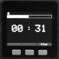

# 3BtnTimer

* 3BtnTimer is a simple kitchen timer app for [M5Stack](http://m5stack.com/).
* It is inspired by a simple kitchen timer which is sold at the DAISO (100-yen shop).

## Requirement

Make sure you have the following libraries:

* [M5Stack library](https://github.com/m5stack/M5Stack) : It is installed if you have followed the m5stack quick-start document.
* [M5Stack-SD-Updater](https://github.com/tobozo/M5Stack-SD-Updater)

## Usage

1. Build the app in usual way (using Arduino IDE).
2. Put `3BtnTimer.bin` to root directory of SD card.
3. Put `jpg/*` to `jpg` directory of SD card.
4. Put `json/3BtnTimer.json` to `json` directory of SD card.
5. Boot `3BtnTimer` from SD Updater or [LovyanLauncher](https://github.com/lovyan03/M5Stack_LovyanLauncher).

## Customize

* To enable beep sound, add `timerEntity.beepingEnabled = true;` to `3BtnTimer.ino#setup()` function.

